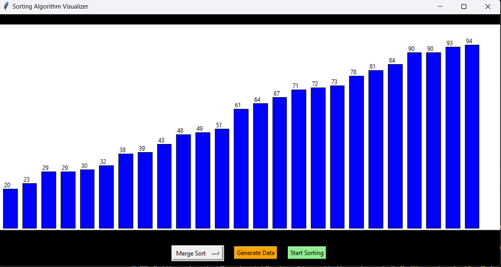

# Sorting Algorithm Visualizer 🧠📊

A beginner-friendly Python project that visually explains how sorting algorithms work using animations.

##  Features

- Visualizes 5 sorting algorithms:
  - Bubble Sort
  - Selection Sort
  - Insertion Sort
  - Merge Sort
  - Quick Sort
- Built using `Tkinter`
- Interactive GUI with dropdown menu
- Real-time color-based comparisons and swaps

##  Tech Used

- Python
- Tkinter (for GUI)
- Core DSA (Sorting)

##  Preview



##  How to Run

```bash
# Clone or download the project
# Open terminal in folder and run:
python main.py
